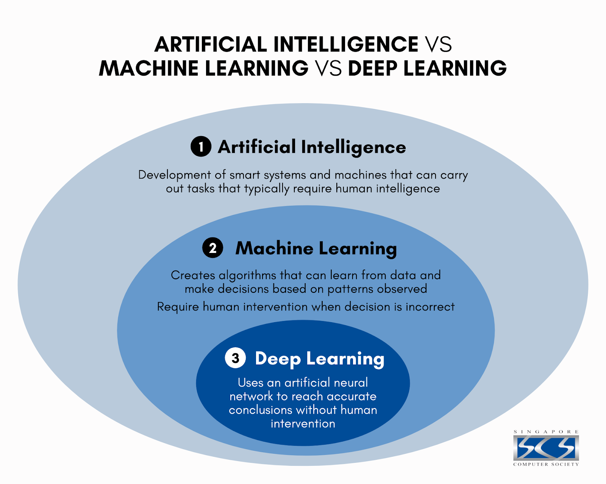
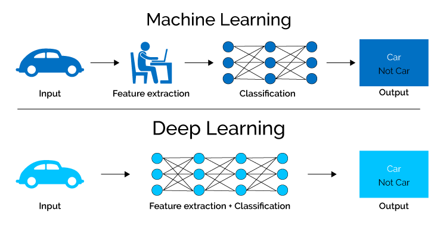

# Introduction 

Building an AI system is a careful process of reverse-engineering human traits 
and capabilities in a machine[^1]:
- Machine Learning: ML teaches a machine how to make inferences and decisions 
based on past experience. It identifies patterns and analyses past data to infer 
the meaning of these data points to reach a possible conclusion without having 
to involve human experience. 

- Deep Learning: Deep Learning is an ML technique. It teaches a machine to process inputs through layers in order to classify, infer and predict the outcome.

- Neural Networks: Neural Networks work on similar principles to Human Neural cells. They are a series of algorithms that captures the relationship between various underlying variables and processes the data as a human brain does.

- Natural Language Processing: NLP is the science of reading, understanding, and interpreting a language by a machine. Once a machine understands what the user intends to communicate, it responds accordingly.

- Computer Vision: Computer vision algorithms try to understand an image by breaking down an image and studying different parts of the object. This helps the machine classify and learn from a set of images to make a better output decision based on previous observations.

-  Cognitive Computing: Cognitive computing algorithms try to mimic a human brain by analyzing text/speech/images/objects in a manner that a human does and tries to give the desired output. Also, take up applications of artificial intelligence courses for free.

# Sillabus

1. Introduction to Python programming and Google Colab
2. A Landscape to machine learning: learning from real data
3. Linear and Logistic Regressors
4. Artificial Neural Networks

# Introduction to python

# Landscape to machine learning

# Linear Regressor

# Logistic Regressor 

# Artificial Neural Network

by Gerardo Marx June 2023

[^1]: https://www.mygreatlearning.com/blog/what-is-artificial- intelligence/
